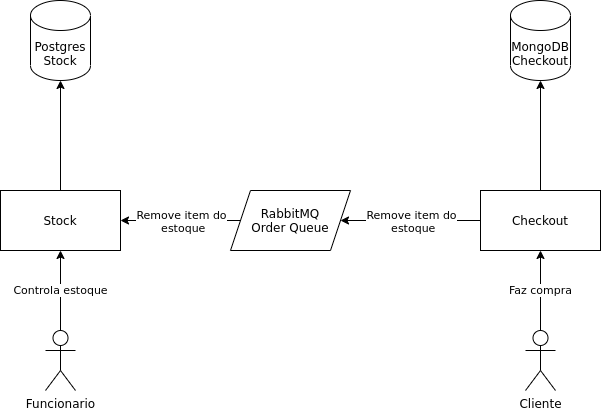

# Trabalho de sistemas distribuidos
Nesse trabalho desenvolvemos um pequeno exemplo de ecommerce

## Integrantes do grupo
Nome do grupo: Dragoes alados

Enzo Beltrami - RA:1811513200  
Luan Michel Giomo - RA: 1811514614  
Guilherme Munhoz Lima - RA: 1811514156  
Alex Leite do Canto - RA: 1811513389 

## Desenho Arquitetural
O sistema e composto por 2 componentes: o projeto Stock responsavel pelo gerenciamento de estoque 
e o projeto Checkout responsavel por efetuar a compra do cliente.

